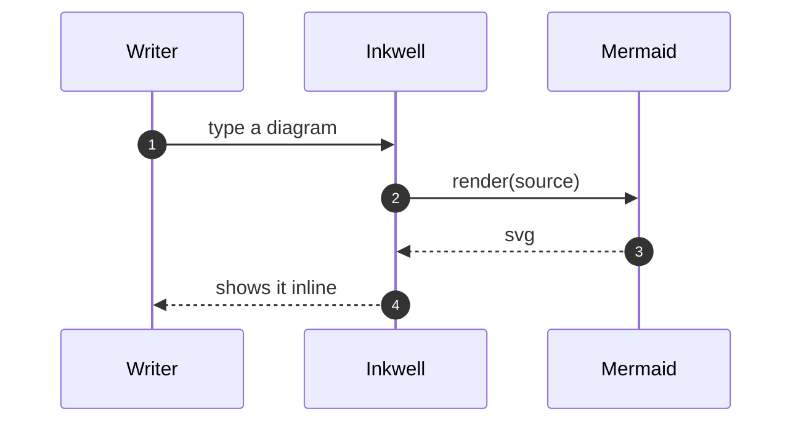
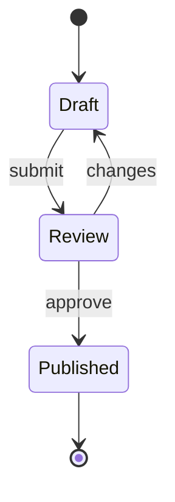

# Diagrams and Maths

Real Mermaid and real KaTeX, both bundled — no network, no CDN.

## Sequence

## State

## Maths

Maxwell, inline: $\nabla \cdot \vec{E} = \frac{\rho}{\varepsilon_0}$

$$\vec{\nabla} \times \vec{B} = \mu_0\left(\vec{J} + \varepsilon_0 \frac{\partial \vec{E}}{\partial t}\right)$$

Chemistry through mhchem: $\ce{CO2 + C -> 2CO}$

$$f(x) = \begin{cases} x^2 & x > 0 \\ 0 & \text{otherwise} \end{cases}$$
